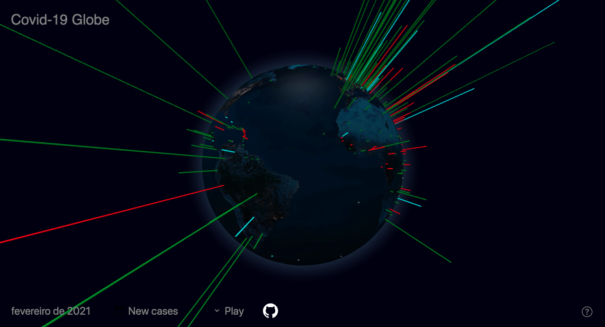

# covid-globe
Visualization of Covid-19 data using [Globe.GL](https://github.com/vasturiano/globe.gl)
[Check it out here!](https://www.caiolang.com/covid-globe/index.html)

## About
This is the final project of the Data Visualization class, taught by [Emmanuel Pietriga](https://pages.saclay.inria.fr/emmanuel.pietriga/) at École Polytechnique

## Dataset
We have used the World Health Organization - WHO - [Covid-19 dataset](https://covid19.who.int/) for this project.

## How to read it
- The **length** of each column encodes the selected metric (New cases, New deaths, Cumulated cases or Cumulated deaths) following a linear scale.

- The columns' **color** indicates the recent variability of the metric:
    - **RED** means the metric has worsened (more cases/deaths) in relation to the last month
    - **GREEN** means it has improved
    - **CYAN** means it has remained stable *(considering a threshold of 10% for stability)*
    - **GRAY** indicates outdated information, or lack of data.
      
## Authors
- [Caio Lang](https://github.com/caiolang)
- [Bruno Sanches](https://github.com/brunosanches)
